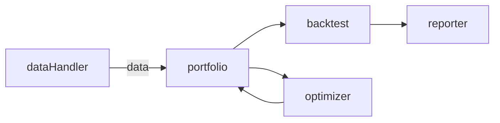
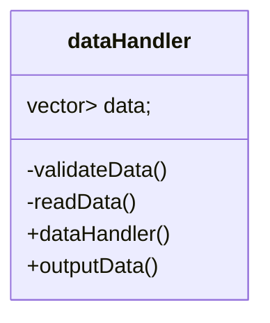
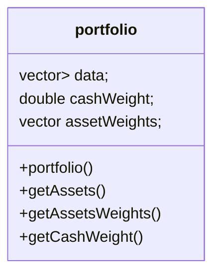
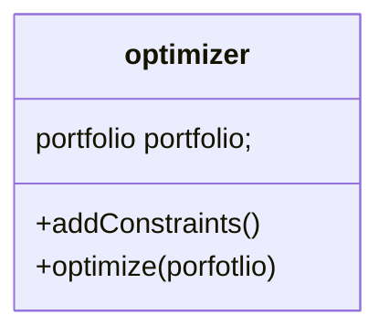
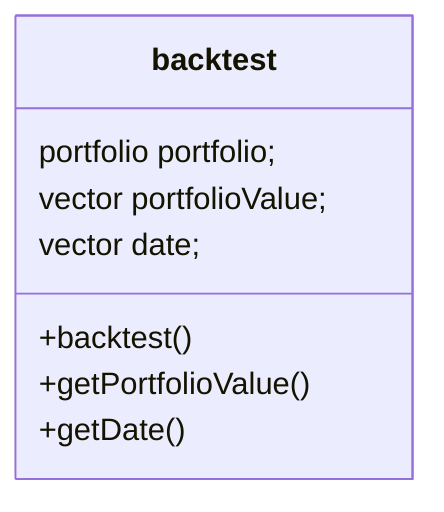
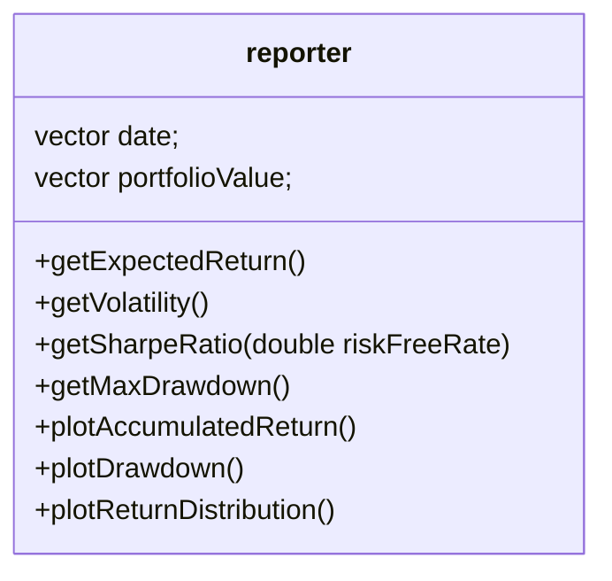

# Midwat Report

Author: [Yanzhong(Eric) Huang](https://bagelquant.com/about-me/)

Based on my current learning progress, I do not yet have the skills necessary to complete this project. Especially for the data visualization part, I have not yet learned how to use the library to visualize the data. But I will learn it in 

However, I have made some progress in the following areas:

- I have completed the overall structure of the project
- Including logics for all modules
    - Input and output for all modules
    - Responsibilities for all modules
    - Class diagram for all modules

> In the below sections, I will provide the details of each module, class design, and child classes.

## Program Structure



## Main Function

```cpp
int main(){

    \\ data input
    dataHandler dh("path/to/csv");

    \\ portfolio construction
    portfolio p(dh.data);

    \\ optimization
    meanVarianceOptimizer o;
    portfolio optimizedPortfolio = o.optimize(p);

    \\ backtest
    backtest b(optimizedPortfolio);

    \\ report
    reporter r(b.getPortfolioValue(), b.getDate());

    r.getExpectedReturn();
    r.getVolatility();
    r.getSharpeRatio(0.02);
    r.getMaxDrawdown();

    r.plotAccumulatedReturn();
    r.plotDrawdown();
    r.plotReturnDistribution();

    return 0;
}
```


## dataHandler Module

### Required Input

- path: string, the path of the csv file

### Resbonsibilities

- Read data from csv file
- Validate data
    - Check the first column is date
    - Check the first row is string (names or ticker)
    - Check no missing data
    - Check numeric data type
- Output data in a table format (2D vector)

### Class Diagram


## Portfolio Module

### Required Input

- data: 2D vector, the data from dataHandler
- Weights(int, 0<=weight<=1): 
    - cashWeight: double, the weight of cash in the portfolio (default 0)
    - assetWeights: vector<double>, the weights of assets
    - cashWeight + sum(assetWeights) = 1

### Responsibilities

- Store:
    - data
    - weights
- Provide portfolio details
    - getAssets()
    - getAssetsWeights()
    - getCashWeight()

### Class Diagram



### Child Classes

- equalWeightPortfolio

## Optimizer Module

### Required Input

- portfolio: portfolio, the portfolio object

### Responsibilities

- Optimize the portfolio weights and return a new portfolio object
- Add constraints for optimization

### Class Diagram



### Child Classes

- meanVarianceOptimizer

## Backtest Module

### Required Input

- portfolio: portfolio, the portfolio object

### Responsibilities

- Backtest the portfolio
    - Using portfolio data and weights to buy in the first day
    - Hold the portfolio for the whole period
- Return: 
    - Portfolio value vector (start from 1)
    - Date vector

### Class Diagram



## Reporter Module

### Required Input

- Date vector
- Data vector

### Responsibilities

- Ratio calculation
    - Expected return
    - Volatility
    - Sharpe ratio(with risk-free rate)
    - Max drawdown
- Visualization
    - Accumulated return
    - Drawdown
    - Return distribution(histogram)

### Class Diagram



