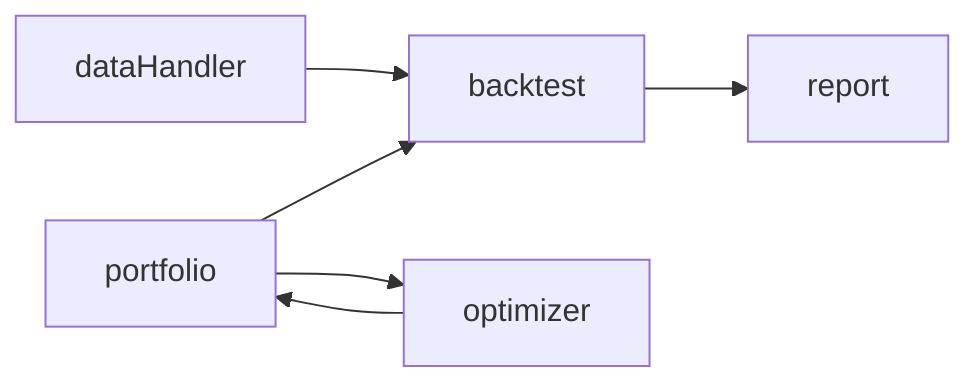
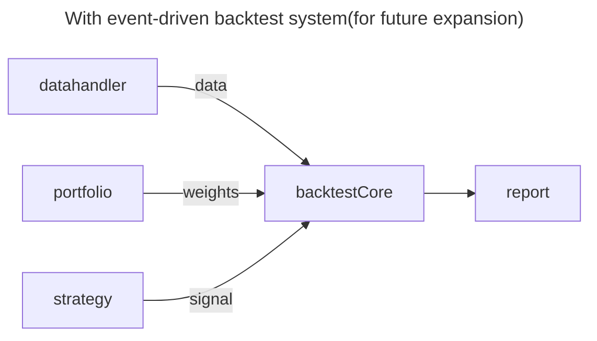

# Proposal for BagelPortfolio Project

## Executive Summary

BagelPortfolio is a portfolio management tool that includes portfolio construction, optimization, and backtesting. The project is initiated by Yanzhong(Eric) Huang, who is a quantitative researcher and software developer. The project is hosted on GitHub at [bagelportfolio](https://github.com/bagelquant/bagelportfolio). The project is open-source and welcomes contributions from the community.

## Introduction

The project is aimed to provide a tool for portfolio managers to:

- Input a list of assets and their historical prices
- Allocate weights to each asset:
    - Mannually allocate weights
    - Allocate weights based on strategies
    - Optimize weights
- Backtest the portfolio:
    - Rebalance strategy
    - A report of portfolio performance
    - Visualization
    - Risk analysis
- Stimulation:
    - Stimulation of portfolio performance under different market conditions

> This project is originated from author's academic project for Object Oriented Programming(C++) course at Rutgers Business School. 

## Program Structure

### Backend

- `dataHandler`: a data input module
    - first version: input from csv file with structured data
    - Future expansion:
        - input from database
        - input from API
        - data validation
- `portfolio`: do not contain any data, only weights of assets
    - first version: a portfolio construction module with weights allocation
- `optimizer`: a portfolio optimization module
    - first version: A abstract class for all optimization methods
    - future expansion:
        - advanced optimization
        - optimization with constraints
- `backtest` Module
    - first version: this module will provide a simple vectorized backtest without any transaction cost and trading signal.
    - future expansion: change to a event-driven backtest system
- `report` Module

### Frontend

This program will not include a frontend module in the first version. The author will consider adding web-based or qt-based GUI in the future.

### Future Expansion

> In this version, optimizer will be a special case of strategy

## Roadmap

> Each sprint will last for 1 week.

- sprint 1
    - proposal and project setup
- sprint 2
    - dataHandler module
    - portfolio module
- sprint 3
    - backtest module
- sprint 4
    - optimizer module
    - report module
- sprint 5
    - documentation
    - testing

